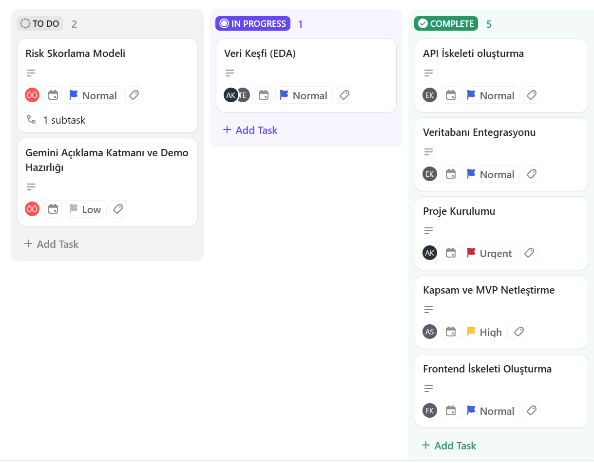
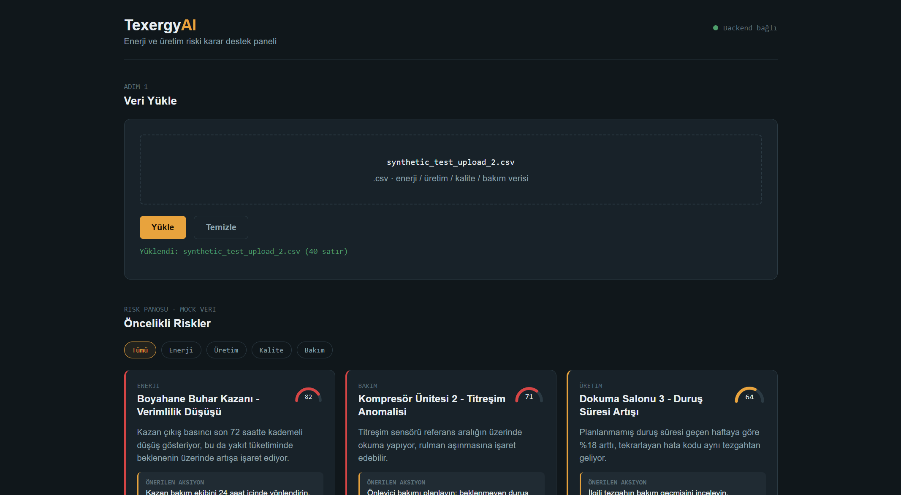
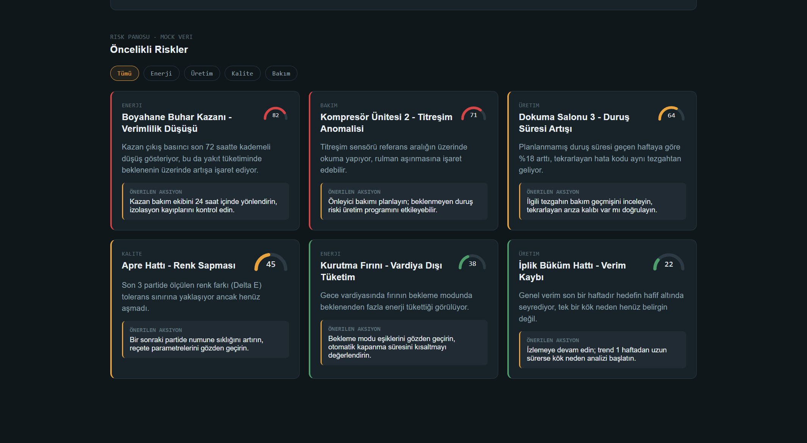

# Takım 52

## Takım Üyeleri

- Taha Yiğit Erdoğan — Scrum Master
- Nur Ecem Korkmaz — Product Owner
- Asude Kosova — Developer
- Adnan Sağ — Developer
- Ömer Özen — Developer

---

# Ürün İsmi
Texergy AI

---

# Ürün Açıklaması
Texergy AI, tekstil üretim tesislerinde enerji, üretim ve kalite verilerini yapay zekâ ile analiz ederek verimsizlikleri, operasyonel riskleri ve anormallikleri tespit eden karar destek platformudur. Sistem, mevcut CSV/Excel verileriyle çalışır ve yöneticilere anlaşılır aksiyon önerileri sunar.

---

# Ürün Özellikleri

- CSV/Excel veri yükleme
- Enerji, üretim ve kalite verilerinin analizi
- Yapay zekâ ile anormallik ve risk tespiti
- Dashboard üzerinden sonuçların görselleştirilmesi
- Gemini API ile açıklama ve aksiyon önerileri
- SCADA, EMS ve ERP sistemleriyle uyumlu çalışma

---

# Hedef Kitle

- Tekstil üretim tesisleri
- Fabrika yöneticileri
- Enerji yöneticileri
- Üretim planlama ekipleri
- Bakım ve kalite kontrol ekipleri

---

# Sprint 1

## Product Backlog

Sprint sürecindeki görev planlaması, görev dağılımı ve ilerleme takibi ClickUp üzerinden gerçekleştirilmiştir.

**Backlog Linki:** [ClickUp Sprint Backlog](https://app.clickup.com/90182837082/v/l/7-90182837082-1)

**Product Backlog Ekran Görüntüsü:**

**Sprint Puanlaması:**

Sprint 1 kapsamında toplam **10 görev** planlanmış, toplam **13 puan** olarak değerlendirilmiştir. Sprint sonunda **6 görev** tamamlanmış ve toplam **6 puan** alınmıştır.

**Daily Scrum:**

Ekip içi günlük iletişim WhatsApp üzerinden yürütülmüş, teknik değerlendirme toplantıları ve sprint planlamaları ise Google Meet üzerinden gerçekleştirilmiştir.

**Meet ve WhatsApp Ekran Görüntüleri:**

---

## Ürün Geliştirme Durumu

Sprint sonunda backend tarafında FastAPI ayakta, yüklenen CSV dosyaları Supabase (PostgreSQL) üzerinde saklanmaktadır. Frontend tarafında Vite + React ile proje iskeleti kurulmuş, dosya yükleme ekranı backend'e bağlanmış ve mock veriyle çalışan, kategori bazlı filtrelenebilir bir risk dashboard'u geliştirilmiştir. 

**Ürün Geliştirme Ekran Görüntüsü:**

---

## Sprint Review

- Proje kapsamı ve hedef kullanıcı kitlesi belirlendi.
- MVP kapsamındaki temel özellikler netleştirildi.
- Backend altyapısı kuruldu.
- Frontend altyapısı kuruldu.
- İlk veri setleri incelenmeye başlandı.

13 puanlık hedefin 6 puanı tamamlanmıştır. Eksik kalan kısım, Sprint 2'de tamamlanacaktır.

---

## Sprint Retrospective

Veri setlerinin uygunluğu ve teknik altyapı kurulumu konusunda beklenenden daha kapsamlı araştırma yapılması gerektiği görülmüştür.

**Bir sonraki sprintte hedeflenenler:**

- Veri setinin kesinleştirilmesi
- Risk skorlama algoritmasının geliştirilmesi
- Yapay zekâ açıklama katmanının entegrasyonu
- Dashboard'un gerçek verilerle çalıştırılması
- MVP'nin daha işlevsel hale getirilmesi
