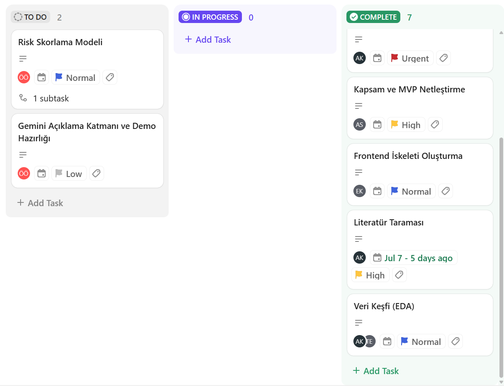

# Takım 52

## Takım Üyeleri

- Taha Yiğit Erdoğan — Scrum Master
- Nur Ecem Korkmaz — Product Owner
- Asude Kosova — Developer
- Adnan Sağ — Developer
- Ömer Özen — Developer

---

# Ürün İsmi
Texergy AI

---

# Ürün Açıklaması
Texergy AI, tekstil üretim tesislerinde enerji, üretim ve kalite verilerini yapay zekâ ile analiz ederek verimsizlikleri, operasyonel riskleri ve anormallikleri tespit eden karar destek platformudur. Sistem, mevcut CSV/Excel verileriyle çalışır ve yöneticilere anlaşılır aksiyon önerileri sunar.

---

# Ürün Özellikleri

- CSV/Excel veri yükleme
- Enerji, üretim ve kalite verilerinin analizi
- Yapay zekâ ile anormallik ve risk tespiti
- Dashboard üzerinden sonuçların görselleştirilmesi
- Gemini API ile açıklama ve aksiyon önerileri
- SCADA, EMS ve ERP sistemleriyle uyumlu çalışma

---

# Hedef Kitle

- Tekstil üretim tesisleri
- Fabrika yöneticileri
- Enerji yöneticileri
- Üretim planlama ekipleri
- Bakım ve kalite kontrol ekipleri

---

# Sprint 1

## Product Backlog

Sprint sürecindeki görev planlaması, görev dağılımı ve ilerleme takibi ClickUp üzerinden gerçekleştirilmiştir.

**Backlog Linki:** [ClickUp Sprint Backlog](https://app.clickup.com/90182837082/v/l/7-90182837082-1)

**Product Backlog Ekran Görüntüsü:**

**Sprint Puanlaması:**

Sprint 1 kapsamında toplam **10 görev** planlanmış, toplam **13 puan** olarak değerlendirilmiştir. Sprint sonunda **6 görev** tamamlanmış ve toplam **6 puan** alınmıştır.

**Daily Scrum:**

Ekip içi günlük iletişim WhatsApp üzerinden yürütülmüş, teknik değerlendirme toplantıları ve sprint planlamaları ise Google Meet üzerinden gerçekleştirilmiştir.

**Meet ve WhatsApp Ekran Görüntüleri:**

[Sprint 1 Daily Scrum Chats](docs/sprint1/Sprint1_Daily_Scrum_Chats.docx)

---

## Ürün Geliştirme Durumu

Sprint sonunda backend tarafında FastAPI ayakta, yüklenen CSV dosyaları Supabase (PostgreSQL) üzerinde saklanmaktadır. Frontend tarafında Vite + React ile proje iskeleti kurulmuş, dosya yükleme ekranı backend'e bağlanmış ve mock veriyle çalışan, kategori bazlı filtrelenebilir bir risk dashboard'u geliştirilmiştir. 

**Ürün Geliştirme Ekran Görüntüsü:**

---

## Sprint Review

- Proje kapsamı ve hedef kullanıcı kitlesi belirlendi.
- MVP kapsamındaki temel özellikler netleştirildi.
- Backend altyapısı kuruldu.
- Frontend altyapısı kuruldu.
- İlk veri setleri incelenmeye başlandı.

13 puanlık hedefin 6 puanı tamamlanmıştır. Eksik kalan kısım, Sprint 2'de tamamlanacaktır.

---

## Sprint Retrospective

Veri setlerinin uygunluğu ve teknik altyapı kurulumu konusunda beklenenden daha kapsamlı araştırma yapılması gerektiği görülmüştür.

**Bir sonraki sprintte hedeflenenler:**

- Veri setinin kesinleştirilmesi
- Risk skorlama algoritmasının geliştirilmesi
- Yapay zekâ açıklama katmanının entegrasyonu
- Dashboard'un gerçek verilerle çalıştırılması
- MVP'nin daha işlevsel hale getirilmesi

# Sprint 2

## Product Backlog

Sprint sürecindeki görev planlaması, görev dağılımı ve ilerleme takibi ClickUp üzerinden gerçekleştirilmiştir.

**Backlog Linki:** [ClickUp Sprint Backlog](https://app.clickup.com/90182837082/v/l/7-90182837082-1)

**Product Backlog Ekran Görüntüsü:**

**Sprint Puanlaması:**

Sprint 1'de tamamlanamayan 7 puanlık iş Sprint 2'ye devredilmiştir. Bu doğrultuda Sprint 2 kapsamında toplam **10 puanlık görev** planlanmış, Sprint sonunda **6 puan** tamamlanmıştır.

**Daily Scrum:**

Ekip içi günlük iletişim WhatsApp üzerinden yürütülmüş, teknik değerlendirme toplantıları ve sprint planlamaları ise Google Meet üzerinden gerçekleştirilmiştir.

**Meet ve WhatsApp Ekran Görüntüleri:**

[Sprint 2 Daily Scrum Chats](docs/sprint2/Sprint2_Daily_Scrum_Chats.docx)

---

## Ürün Geliştirme Durumu

Sprint 2 boyunca sistemin veri analizi ve yapay zekâ tarafındaki temel bileşenleri geliştirilmiştir.

- Tekstil üretim süreçlerinde kullanılan enerji, üretim ve kalite parametreleri için akademik makaleler ve sektör raporları incelenerek referans değer aralıkları belirlenmiştir.
- Bu referanslar doğrultusunda sentetik veri seti yeniden oluşturularak daha gerçekçi ve model eğitimine uygun hale getirilmiştir.
- Jupyter Notebook ortamında kapsamlı EDA (Exploratory Data Analysis) gerçekleştirilmiş; veri kalitesi, dağılımlar, korelasyonlar ve üretim süreçlerine ilişkin istatistiksel analizler tamamlanmıştır.
- Enerji tüketimi, üretim verimliliği, kalite ve anormallik ilişkileri analiz edilmiştir.
- XGBoost tabanlı anormallik tespit modeli eğitilmiş ve model çıktıları değerlendirilmiştir.
- Dashboard tasarımı ve analiz ekranlarını hızlı doğrulamak amacıyla Streamlit tabanlı bir prototip geliştirilmiştir. Bu çalışma yalnızca veri analizi sonuçlarının görselleştirilmesi ve kullanıcı deneyiminin test edilmesi amacıyla hazırlanmış olup, nihai ürün mimarisinde React + FastAPI kullanılacaktır.
- Dashboard üzerinde tesis, makine ve vardiya bazlı filtreleme yapısı oluşturulmuştur.
- Farklı kullanıcıların yükleyeceği CSV dosyalarının sisteme uyarlanabilmesi için veri eşleştirme (mapping) yapısı planlanmıştır.
- Gemini API ile üretilecek aksiyon önerileri ve açıklama katmanı için sistem mimarisi tasarlanmıştır.

## Sprint Review

- Akademik kaynaklardan elde edilen referans değerlerle veri seti yeniden tasarlanmıştır.
- Sentetik veri setinin gerçek üretim ortamını daha iyi temsil etmesi sağlanmıştır.
- EDA çalışmaları tamamlanmıştır.
- XGBoost tabanlı anormallik tespit modeli geliştirilmiştir.
- Dashboard tasarımı Streamlit üzerinde prototip olarak hazırlanmış ve analiz ekranları doğrulanmıştır.
- React ve FastAPI tabanlı nihai sistem mimarisi netleştirilmiştir.
- Gemini entegrasyonu için teknik tasarım tamamlanmıştır.
- Sprint kapsamında hedeflenen 10 puanın 6 puanı tamamlanmıştır.

---

## Sprint Retrospective

Veri setlerinin uygunluğu ve teknik altyapı kurulumu konusunda beklenenden daha kapsamlı araştırma yapılması gerektiği görülmüştür.

**Bir sonraki sprintte hedeflenenler:**

- React tabanlı arayüz geliştirmelerine öncelik verilmesine karar verilmiştir.
- Streamlit prototipinde doğrulanan dashboard bileşenlerinin React arayüzüne taşınması planlanmıştır.
- FastAPI ile yapay zekâ modeli arasındaki entegrasyon Sprint 3'te tamamlanacaktır.
- CSV kolon eşleştirme (mapping) mekanizması geliştirilerek farklı fabrika veri formatlarının desteklenmesi hedeflenmiştir.
- Gemini API entegrasyonunun tamamlanması ve model çıktılarının doğal dilde açıklanması Sprint 3 kapsamına alınmıştır.
- MVP'nin daha işlevsel hale getirilmesi